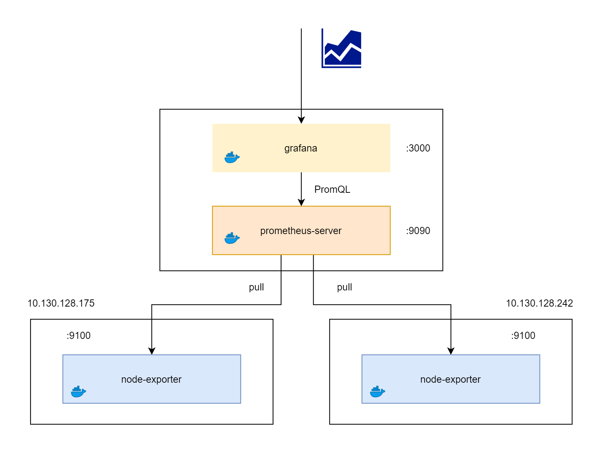

# Hello World 



# Requires

- 1 Prometheus Server
- 2 Target Nodes 

# Every Server

```sh
$ git clone https://github.com/jittagornp/prometheus-example.git
$ cd prometheus-example 
$ cd hello-world  
$ chmod 777 install-docker.sh
$ ./install-docker.sh
```

# Prometheus Server

1. ติดตั้ง Prometheus 

แก้ไข IP ของ Target Nodes ใน `prometheus.yml` จากนั้น 

```sh
$ docker run -d --name=prometheus-server -v $(pwd)/prometheus.yml:/etc/prometheus/prometheus.yml -p 9090:9090 prom/prometheus:latest 
```

Test   

> http://<HOST_NAME or IP>:9090 

จากนั้นลองเขียน PromQL เพื่อ Query Metric ตามเงื่อนไขที่ต้องการ 

2. ติดตั้ง Grafana 
```sh
$ docker run -d --name=grafana -p 3000:3000 -e "GF_SECURITY_ADMIN_PASSWORD=password"  grafana/grafana 
```

Test   

> http://<HOST_NAME or IP>:3000 

Add Data Source ที่เป็น Prometheus 

# Target Nodes 

1. ติดตั้ง Node Exporter 
```sh
$ docker run -d --name=node-exporter -p 9100:9100 prom/node-exporter:latest 
```

# Example 

