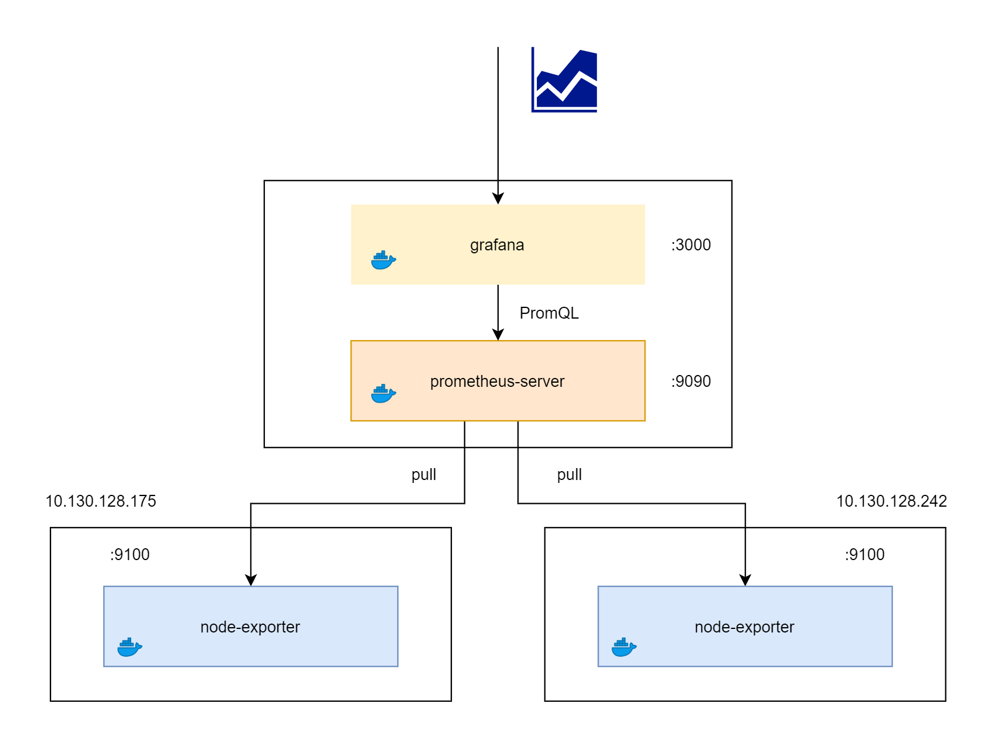
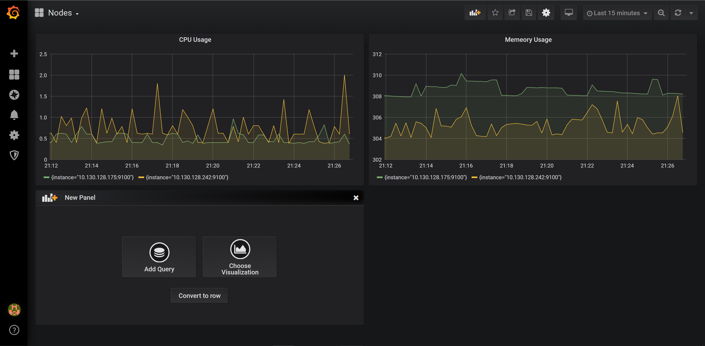

# Simple Node Exporter



# Requires

- 1 Prometheus Server
- 2 Target Nodes 

# Every Server

Clone Script + Source Code จาก Git 

```sh
$ git clone https://github.com/jittagornp/prometheus-example.git
$ cd prometheus-example  
```

ติดตั้ง Docker
```sh
$ cd scripts
$ chmod 777 install-docker.sh
$ ./install-docker.sh
$ cd ..
```

# Prometheus Server

ติดตั้ง Prometheus 
  
แก้ไข IP ของ Target Nodes ใน `prometheus.yml` จากนั้น 

```sh
cd simple-node-exporter  
$ docker run -d --name=prometheus-server -v $(pwd)/prometheus.yml:/etc/prometheus/prometheus.yml -p 9090:9090 prom/prometheus:latest 
```

ลองเปิด Prometheus ดู    

> http://<HOST_NAME or IP>:9090 

จากนั้นลองเขียน PromQL เพื่อ Query Metric ตามเงื่อนไขที่ต้องการ 

ติดตั้ง Grafana 
```sh
$ docker run -d --name=grafana -p 3000:3000 -e "GF_SECURITY_ADMIN_PASSWORD=password"  grafana/grafana 
```

ดูเปิด Grafana ดู (username = admin, password = password ตามที่กำหนดไว้ตอน run docker)  

> http://<HOST_NAME or IP>:3000 

Add Data Source ที่เป็น Prometheus เข้าไป

# Target Nodes 

ติดตั้ง Node Exporter ที่ Node ที่ต้องการ Monitor 
```sh
$ docker run -d --name=node-exporter -p 9100:9100 prom/node-exporter:latest 
```

จากนั้นลองเข้าไปที่ Grafana เพื่อ Add Dashboard ตามที่ต้องการ 

# Example 

