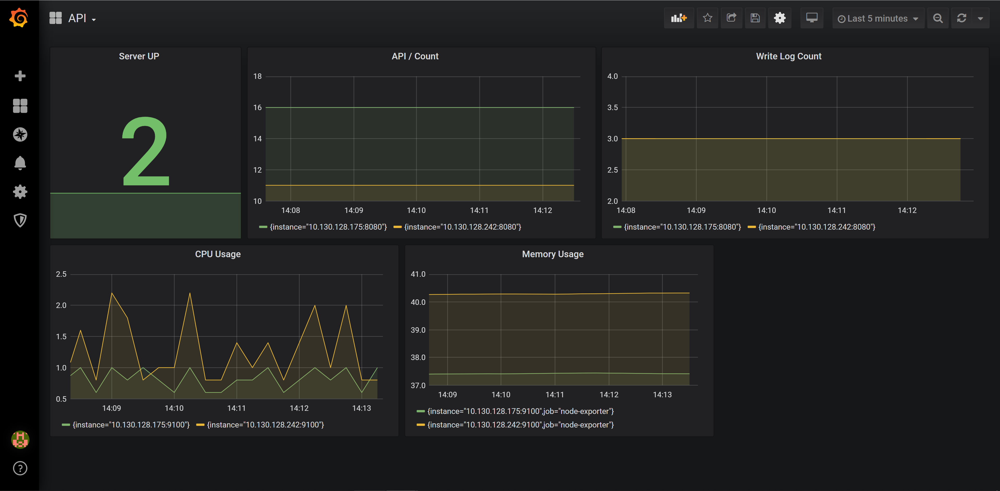

# Spring-boot Reactive Prometheus

ทำการติดตั้งทุกอย่างเหมือนกับตัวอย่าง `simple-node-exporter` ที่ผ่านมา เพียงแต่   
1. ตอน run Prometheus ให้ใช้ `prometheus.yml` ในตัวอย่าง `spring-boot-reactive-prometheus` แทน (อย่าลืมแก้ IP)
2. แต่ละ Target Nodes ให้ทำการ run Spring-boot Application เพิ่มเติมเข้าไป 

# การ Run Spring-boot Application บน Target Nodes

```sh
$ cd spring-boot-reactive-prometheus
$ chmod 777 deploy.sh
$ ./deploy.sh
```

# Simple PromQL

### Server UP
```
sum(up{job="spring-boot-reactive-prometheus"})
```

### API / Count
```
sum(http_server_requests_seconds_count{job="spring-boot-reactive-prometheus", uri="/"}) by (instance)
```

### Write Log Count
```
sum(logback_events_total{job="spring-boot-reactive-prometheus"}) by (instance)
```

### CPU Usage
```
100 - (avg by (instance) (irate(node_cpu_seconds_total{job="node-exporter",mode="idle"}[5m])) * 100)
```

### Memory Usage 
```
100 * (1 - ((avg_over_time(node_memory_MemFree_bytes[10m]) + avg_over_time(node_memory_Cached_bytes[10m]) + avg_over_time(node_memory_Buffers_bytes[10m])) / avg_over_time(node_memory_MemTotal_bytes[10m])))
```

# Example 


